# Full Stack Development 2 - Assignment.

__Name:__ David Cotter 

## Features.

[A bullet-point list of the features developed for the React SPA app (only new/modified ones for the Movies app),]

+ Upcoming Movies page
+ Tv Series page
+ Popular Movies page
+ Favourite Movies page
+ Trending Movies page
+ Fantasy Movie page
+ Tv Series Details page
+ Movies Reviews

## Feature Design.

#### Upcoming Movies.

> Lists movies from the Upcoming movies endpoint of TMDB.

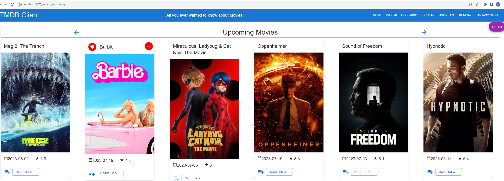

#### Popular Movies.

> Lists movies from the Popular movies endpoint of TMDB.

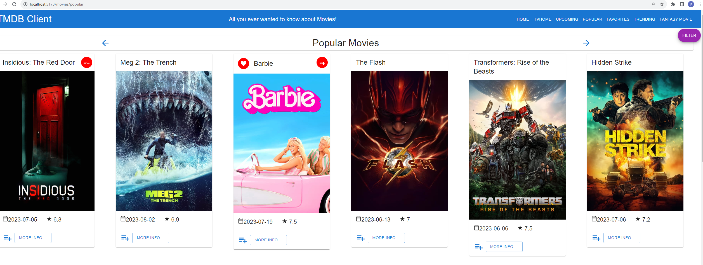

#### Favourite Movies.

> Lists movies marked as favourites.

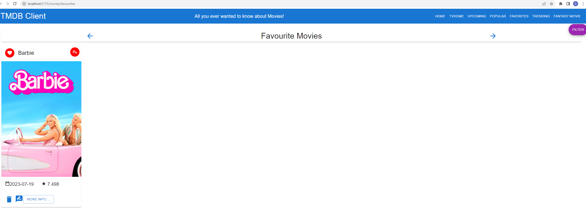

#### Trending Movies.

> Lists movies from the Trending movies endpoint of TMDB.

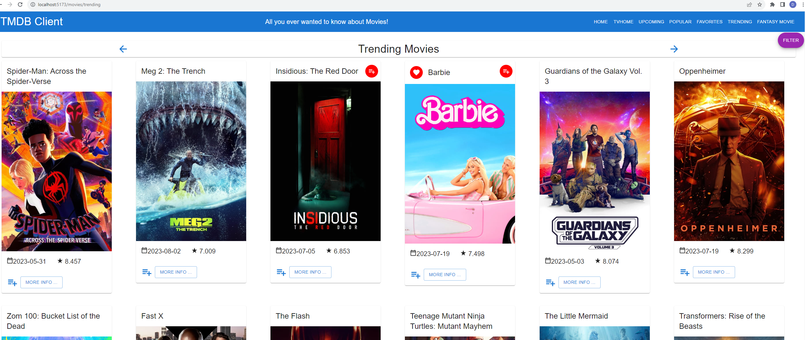

#### Fantasy Movie.

> Allows users to create and submit a fantasy Movie.

#### Movies Reviews.

> Lists all the reviews for a particular movie (shows text extract only).

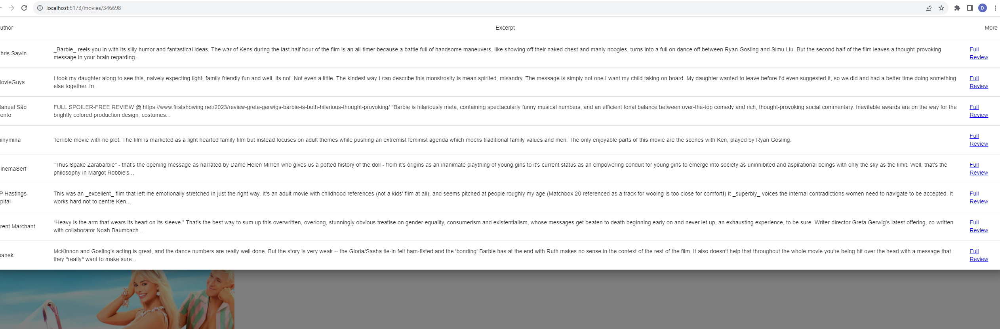

> Click the 'Full Review' link of a review extract to see the review's full text. 

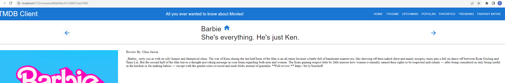

> Ability to write a review for a specific movie. 

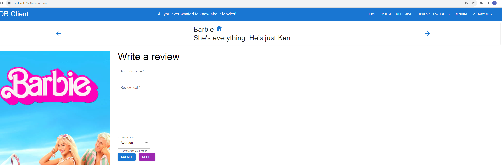

#### Tv Series.

> Lists the Tv Series from the discover tv series endpoint of TMDB.

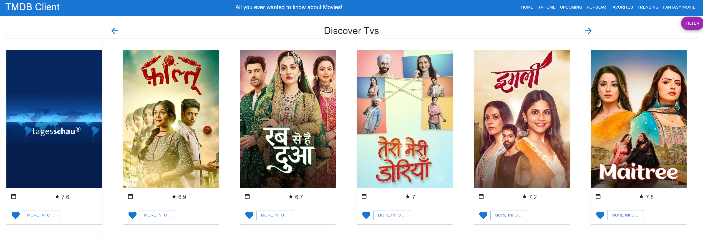

#### Tv Series Details.

> Shows the details page of the tv series.

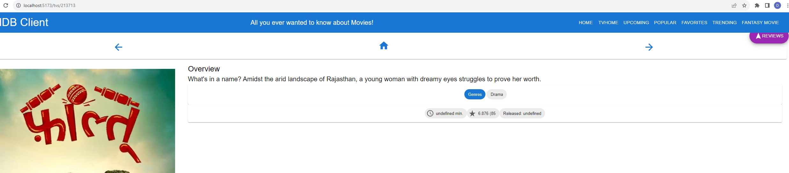

.... other features .......

## Storybook.

See below screenshot of storybook UI, i have added TvDetails and TvCard on top of previously created stories.

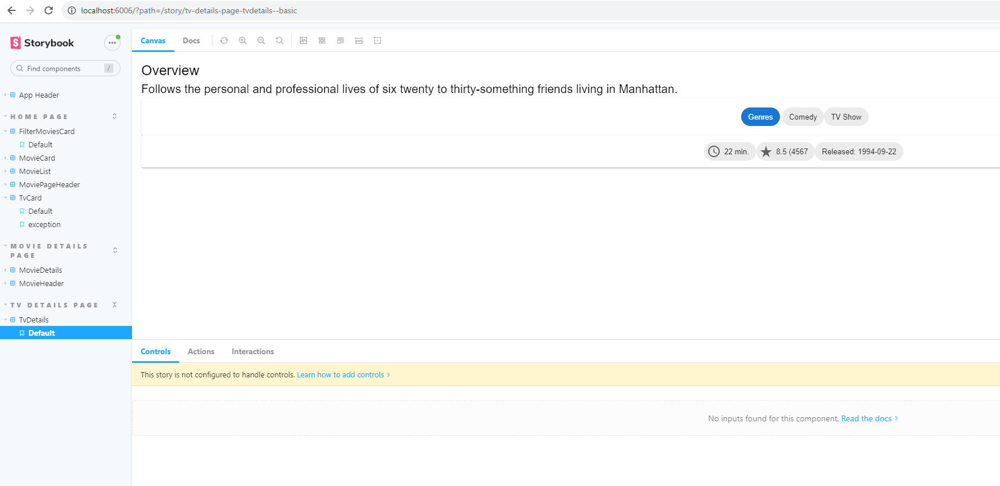

## Authentication. (if relevant)

#### Protected routes 

[List all the routes in your app and highlight those that are protected/private (require authentication).]

e.g.

+ /movies - List of 20  movies from the Discover endpoint,
+ /movies/{movie_id} - Detailed information on a specific movie.
+ /reviews/{review_id} (Protected) - The full text of a movie review.
+ /movie/{movie_id}/similar - A list of similar movies. 
+ /person/{person_id} (Protected) - A specific actor's bio.
+ etc
+ etc

#### Protected functionality. (if relevant)

[ Briefly state any app functionality that requires authentication, e.g. only authenticated users can tag a movie as a 'favourite'.]

#### Supabase (if relevant)

[Include a screenshot(s) from your Supabase account that verifies its use for this app. ]

## Deployment (if relevant).

https://movies-app-assignment-six.vercel.app/ 
Partially functional.
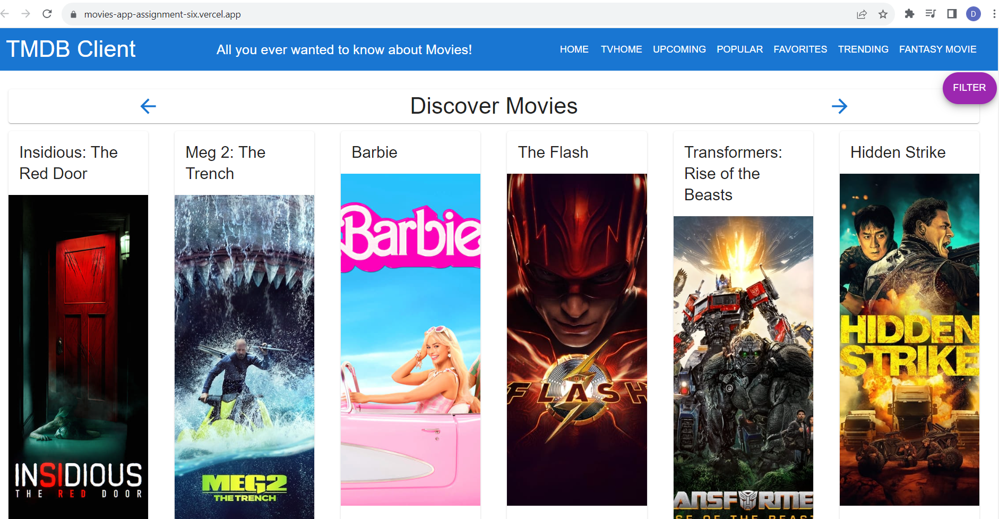

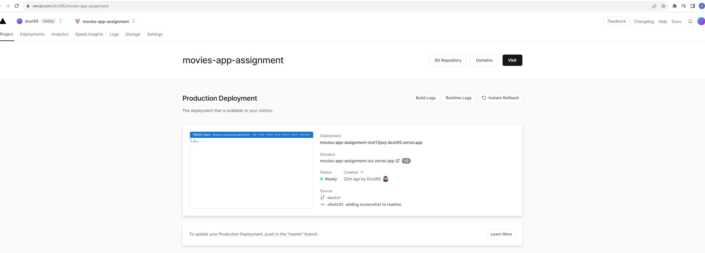

## Persistence (if relevant).

[If you are persisting data to the Supabase backend (e.g. favourite movies, fantasy movie), include screenshots with appropriate captions to verify this aspect. ]

## Additional Information.

[ Briefly explain any other aspects of your app's design or implementation that is non-standard and worthy of mention.]

[image1]: ./images/image1.png
[image2]: ./images/image2.png
[image3]: ./images/image3.png
[image4]: ./images/image4.png
[image5]: ./images/image5.png